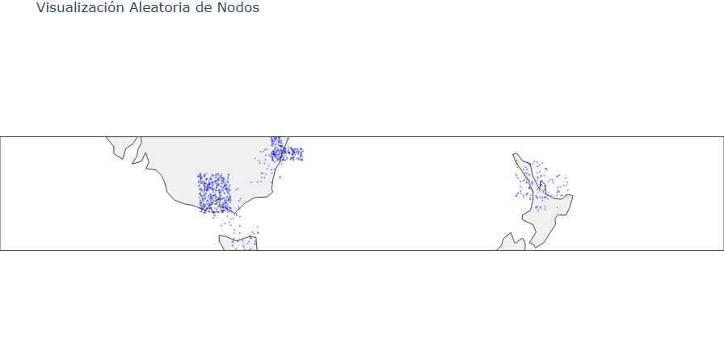
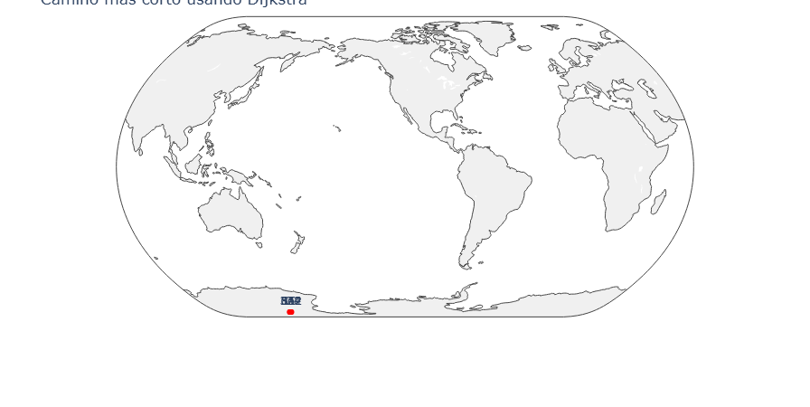

# Análisis de Algoritmos y Visualización del Grafo de la Red ‘X’


## UNIVERSIDAD LA SALLE DE AREQUIPA

### CARRERA:
**Ingeniería de Software**

### CURSO:
**Análisis y Diseño de Algoritmos**

---

### INTEGRANTES:
- Quispe Cjuiro Danny  
- Vizarreta Checya Carlos

### DOCENTE:
**Edson Francisco Luque Mamani**

### SEMESTRE:
**V – 2025 - I**

---

**Arequipa, 2025**


---


## Introducción
### Motivación
Las redes sociales son estructuras complejas que reflejan interacciones humanas a gran escala. Analizar estas redes permite descubrir patrones de conectividad, identificar comunidades y entender dinámicas sociales, con aplicaciones en marketing, sociología y tecnología.

### Objetivos
El objetivo principal es analizar y visualizar la estructura del grafo de la red social ‘X’ para identificar patrones, comunidades y propiedades de la red, utilizando algoritmos avanzados y visualizaciones interactivas.

## Conjunto de Datos
- **Nombre**: Red Social ‘X’
- **Fuente**: [Google Drive](https://drive.google.com/drive/folders/1XvzgZ3NKo3EruGOHDirM6bQwfc8fejpl?usp=sharing)
- **Descripción**: Subconjunto de usuarios de la red social ‘X’ con sus conexiones y ubicaciones geográficas. Los usuarios son nodos, y las conexiones (no mutuas) son aristas dirigidas, formando un componente conectado.
  - **Archivos**:
    - `10_million_location.txt.zip`: Contiene latitud y longitud de 10 millones de usuarios. Formato: `lat_i, long_i`.
    - `10_million_user.txt.zip`: Lista de adyacencia de usuarios, donde la i-ésima fila representa las conexiones del usuario i. Formato: `j, k, l, ...`.

## Esquema del Proyecto
### 1. Preprocesamiento de Datos
- **Limpieza de Datos**: Se manejan datos faltantes o inconsistentes en los archivos de ubicación y usuarios.
- **Construcción del Grafo**: Se implementa un grafo dirigido en Python usando las clases `Vertice` y `Grafo`. Los pesos de las aristas representan distancias geográficas calculadas con la fórmula Haversine.

**Fragmento de Código - Construcción del Grafo**:
```python
class Vertice:
    __slots__ = ('valor', 'latitud', 'longitud', 'vecinosSalida', 'vecinosEntrada', ...)
    def __init__(self, valor, latitud=None, longitud=None):
        self.valor = valor
        self.latitud = latitud
        self.longitud = longitud
        self.vecinosSalida = {}
        self.vecinosEntrada = {}
        self.reset_attributes()

class Grafo:
    def __init__(self):
        self.vertices = []
    def agregarAristaDirigida(self, u, v, peso=1):
        u.agregarVecinoSalida(v, peso)
        v.agregarVecinoEntrada(u, peso)
```

**Fragmento de Código - Carga de Datos**:
```python
def cargarUbicaciones(ruta_ubicacion, chunk_size=100000):
    grafos = Grafo()
    dtype = {'latitud': np.float32, 'longitud': np.float32}
    for chunk in pd.read_csv(ruta_ubicacion, header=None, names=['latitud', 'longitud'], chunksize=chunk_size, dtype=dtype):
        indices = chunk.index + 1
        latitudes = chunk['latitud'].values
        longitudes = chunk['longitud'].values
        for idx, lat, lon in zip(indices, latitudes, longitudes):
            grafos.agregarVertice(Vertice(valor=idx, latitud=lat, longitud=lon))
    return grafos
```

### 2. Análisis Exploratorio de Datos (EDA)
- **Estadísticas Básicas**: Se calculan el número de nodos, aristas y la densidad del grafo.
- **Visualización**: Se genera una visualización geográfica inicial de una muestra de nodos usando Plotly.

**Fragmento de Código - Estadísticas Básicas**:
```python
total_aristas = sum(len(v.vecinosSalida) for v in grafos.vertices)
print(f"Resumen del grafo:")
print(f"- Vertices: {len(grafos.vertices)}")
print(f"- Aristas: {total_aristas}")
print(f"- Densidad: {total_aristas / (len(grafos.vertices) * (len(grafos.vertices) - 1)):.6f}")
```

**Visualización de Muestra Geográfica**:

*Figura 1: Visualización de una muestra del 2% de los nodos en un mapa geográfico.*

### 3. Propiedades y Métricas de la Red
- **Detección de Comunidades**: Se aplica el algoritmo de Louvain para identificar comunidades, optimizado para grafos grandes.
- **Modularidad**: Se calcula la modularidad para evaluar la calidad de las comunidades detectadas.

**Fragmento de Código - Algoritmo de Louvain**:
```python
def louvain_optimizado(grafo, delta_q_min=1e-5, cambio_minimo_porcentaje=0.01):
    vertices = grafo.vertices
    comunidad = {v: i for i, v in enumerate(vertices)}
    adyacencia = {v: v.vecinosSalida for v in vertices}
    grados = {v: sum(adyacencia[v].values()) for v in vertices}
    m2 = sum(grados.values())
    while True:
        cambios = 0
        for v in random.shuffle(vertices.copy()):
            c_actual = comunidad[v]
            mejor_comunidad = c_actual
            grado_v = grados[v]
            suma_adyacente = defaultdict(float)
            for u, peso in adyacencia[v].items():
                suma_adyacente[comunidad[u]] += peso
            for c in suma_adyacente:
                if c == c_actual: continue
                ki_in = suma_adyacente[c]
                delta_q = ki_in - (grado_v * sum_tot) / m2
                if delta_q > mejor_delta_q and delta_q > delta_q_min:
                    mejor_comunidad = c
            if mejor_comunidad != c_actual:
                comunidad[v] = mejor_comunidad
                cambios += 1
        if cambios / len(vertices) < cambio_minimo_porcentaje:
            break
    return defaultdict(list, {c: [v.valor for v in vertices if comunidad[v] == c] for c in set(comunidad.values())})
```


### 4. Análisis Avanzado
- **Análisis de Camino Más Corto**: Se implementa el algoritmo de Dijkstra para calcular la longitud promedio de los caminos más cortos desde un nodo origen.
- **Árboles de Expansión Mínima**: Pendiente de implementación en futuras iteraciones.

**Fragmento de Código - Algoritmo de Dijkstra**:
```python
def dijkstra(grafo: Grafo, id_origen: int):
    for v in grafo.vertices:
        v.reset_attributes()
    origen = grafo.vertices[id_origen - 1]
    origen.distEstimada = 0
    heap = [(0, origen)]
    while heap:
        dist_actual, actual = heapq.heappop(heap)
        if actual.estado == "visitado": continue
        actual.estado = "visitado"
        for vecino, peso in actual.obtenerVecinosSalidaConPesos():
            nueva_dist = dist_actual + peso
            if nueva_dist < vecino.distEstimada:
                vecino.distEstimada = nueva_dist
                vecino.padre = actual
                heapq.heappush(heap, (nueva_dist, vecino))
    return {v.valor: v.distEstimada for v in grafo.vertices}
```

**Visualización de Resultados de Dijkstra**:

*Figura 3: Distancias desde un nodo origen calculadas con Dijkstra, con un Facetado por colores según la distancia.*

### 5. Visualización
- **Visualizaciones Interactivas**: Se crean visualizaciones geográficas interactivas con Plotly, mostrando nodos y distancias.
- **Visualización de Comunidades**: Se visualizan comunidades con colores diferenciados para resaltar su estructura.

**Fragmento de Código - Guardar Visualización**:
```python
def visualizar_muestra_geografica(grafo, porcentaje=0.05, titulo="Visualización Aleatoria de Nodos", save_path="img/muestra_geografica.png"):
    vertices = np.array(grafo.vertices, dtype=object)
    muestra_tamaño = max(1, int(len(vertices) * porcentaje))
    indices_muestra = np.random.choice(len(vertices), muestra_tamaño, replace=False)
    muestra = vertices[indices_muestra]
    latitudes = np.fromiter((v.latitud for v in muestra), dtype=np.float32)
    longitudes = np.fromiter((v.longitud for v in muestra), dtype=np.float32)
    node_trace = go.Scattergeo(
        lat=latitudes, lon=longitudes, mode='markers',
        marker=dict(size=2, color='blue', opacity=0.5), hoverinfo='skip'
    )
    fig = go.Figure(data=[node_trace])
    fig.update_layout(title=titulo, showlegend=False, geo=dict(projection_type="natural earth", showland=True))
    fig.write_image(save_path, format="png", width=1200, height=800)
    fig.show()
```

### 6. Conclusión
- **Resumen de Hallazgos**: Se identificaron comunidades significativas y patrones de conectividad basados en ubicaciones geográficas. Las visualizaciones revelan clústeres regionales.
- **Trabajo Futuro**: Implementar árboles de expansión mínima, explorar algoritmos como Girvan-Newman y optimizar el rendimiento para grafos más grandes.

## Requisitos
- **Lenguajes y Bibliotecas**:
  - Python 3.8+
  - Pandas, NumPy, Plotly
- **Instalación**:
  ```bash
  pip install pandas numpy plotly
  ```

## Instrucciones de Uso
1. Descarga los archivos de datos desde el enlace proporcionado.
2. Descomprime `10_million_location.txt.zip` y `10_million_user.txt.zip`.
3. Crea una carpeta `img/` en el directorio del proyecto para almacenar imágenes.
4. Ejecuta el script principal:
   ```bash
   python main.py
   ```
5. Ingresa el ID del nodo origen para ejecutar Dijkstra y generar visualizaciones.
6. Las imágenes se guardarán automáticamente en la carpeta `img/` (asegúrate de que exista).

## Referencias
- Conjunto de datos: [Red Social ‘X’](https://drive.google.com/drive/folders/1XvzgZ3NKo3EruGOHDirM6bQwfc8fejpl?usp=sharing)
- Bibliotecas: [Pandas](https://pandas.pydata.org/), [NumPy](https://numpy.org/), [Plotly](https://plotly.com/python/)
- Algoritmos: Blondel, V. D., et al. (2008). *Fast unfolding of communities in large networks*. Journal of Statistical Mechanics: Theory and Experiment.
- Fórmula Haversine: [Wikipedia](https://en.wikipedia.org/wiki/Haversine_formula)